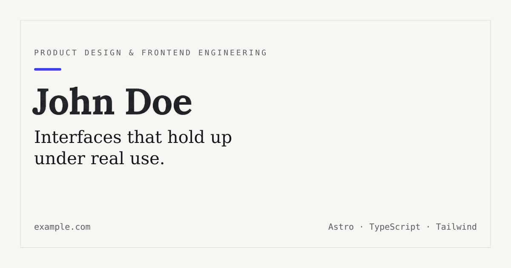

<div align="center">

# Haoran (Cris) Wang - Robotics Portfolio

Astro portfolio scaffold for Haoran Wang's robotics research, selected projects,
technical stack, publications, and CV.

[Live site](https://criswang6.github.io/) · [GitHub profile](https://github.com/CrisWang6)

</div>

<br />

<div align="center">
  
</div>

<br />

## Why this template

- Static Astro site that works well on GitHub Pages.
- Project pages are Markdown files in `src/content/work/`.
- Tailwind CSS keeps the visual system lightweight and easy to adjust.
- Built-in SEO, sitemap, dark mode, and typed content collections.
- Good fit for a research portfolio with publications, project media, and CV sections.

## Quick start

```bash
git clone https://github.com/CrisWang6/CrisWang6.github.io.git
cd CrisWang6.github.io
pnpm install
pnpm dev
```

> Any package manager works.

Open `http://localhost:4321`.

| Command        | Action                                             |
| -------------- | -------------------------------------------------- |
| `pnpm dev`     | Start the local dev server                         |
| `pnpm build`   | Type-check, then build for production to `./dist/` |
| `pnpm preview` | Preview the production build locally               |
| `pnpm check`   | Run `astro check` only                             |
| `pnpm format`  | Format the project with Prettier                   |

## Project structure

```text
├── public/
│   ├── favicon.svg
│   ├── favicons/
│   ├── og-image.png          # replace with your own 1200×630 image
│   └── robots.txt
├── src/
│   ├── assets/               # static images and assets
│   ├── components/           # BaseHead, Button, Footer, Header, SectionHeading, ThemeToggle, WorkRow
│   ├── content/
│   │   └── work/*.md         # one file per project
│   ├── layouts/
│   │   └── BaseLayout.astro  # <head>, SEO, fonts, theme script
│   ├── pages/
│   │   ├── index.astro
│   │   ├── about.astro
│   │   ├── work/[id].astro
│   │   └── 404.astro
│   ├── styles/
│   │   └── global.css        # design tokens + Tailwind import
│   ├── utils/
│   │   └── formatDate.ts     # date formatting helpers
│   ├── content.config.ts     # Zod schema for the "work" collection
│   └── site.config.ts        # name, bio, email, social links
├── astro.config.mjs
└── tsconfig.json
```

## Editing content

Edit `src/site.config.ts` for global identity, links, and contact info.

Add or update projects in `src/content/work/`. Each project is one Markdown file
with frontmatter for title, role, date, tags, links, and feature status.

Required project frontmatter:

```md
---
title: Project Name
summary: One sentence, shown in the list view.
role: Your role on the project
date: 2026-01-15
tags: [Astro, TypeScript]
url: https://example.com # optional
repo: https://github.com/... # optional
featured: true # optional, shows it first on the homepage
---

Full write-up in Markdown.
```

## Deploying

The included GitHub Actions workflow builds the site and deploys `dist/` to
GitHub Pages when changes are pushed to `main`.

## License

MIT — see [LICENSE](./LICENSE). Free to use for personal or commercial projects,
attribution appreciated but not required.
