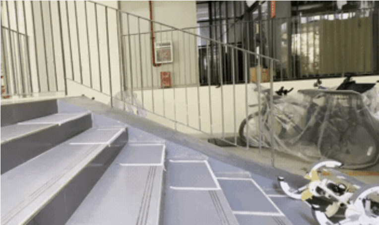
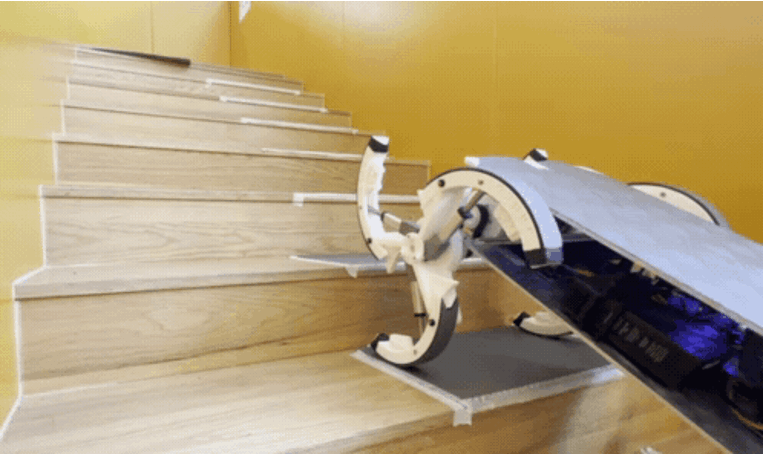

    

WHO AM I
===
I'm Wang Haoran(CrisWang), a senior undergraduate student from [Southern University of Science and Technology(SUSTech)](https://www.sustech.edu.cn), major in **Robotics Engineering** and interest in industry design.

My research interest includes **on-site application robots** and **exoskeleton robots**.

My Curriculum Vita: [here](Haoran Wang_NOC_CV.pdf).

Email: 12011430@mail.sustech.edu.cn

QQ: 1020102265

Publication
===

[**1. A Three-Impeller Wheel-Leg Transformable Robot with Variable Robust Adaptability to Stair Dimensions**](https://ieeexplore.ieee.org/document/10354942)
---
***Author***

•	Design and assemble the Wheel-leg transformable robot SWhegPro3 and test its operating performance.

•	Analyze the results of experiments in both simulation environments and fields. 

•	Independently publish an essay to **the IEEE International Conference on Robotics and Biomimetics 2023**.

    

[**2. Ubiquitous Field Transportation Robots with Robust Wheel-Leg Transformable Modules**]()
---
***Author***

•	Design and assemble the Wheel-leg transformable robot SWhegPro3 and test its operating performance.

•	Analyze the results of experiments in both simulation environments and fields. 

•	Submmited to **IEEE ACCESS**.

    

**3. Pressure Insole Correction Method Based on Machine Learning Prediction Center of Pressure (In progress)**
---
***Author***

•	Restructure the preprocess of the datasets and construct a seq2seq network to predict the center of pressure of insoles.

•	Load the network on hardware to calibrate the sensor insoles, test the result of calibration.

Projects
===
**1. A Parallel Five-Bar SCARA Robot with Suction Cup Manipulator**
---
***Project Member***

•	Redesign the five-bar parallel robot, integrate the suction cup to the end effector as the manipulator, and then control the end effector to accurately move objects.

•	Make a video to demonstrate the performance and working principle of the SCARA robot we design.

    

**2. Mobile Kitchen Waste Classifying Robot**
---
***Project Member***

•	Find the pains and needs of the residents living in apartments who are annoyed with waste in their homes.

•	Designed a user-friendly mobile garbage sorting robot, which is equipped with three-axis robotic arms and sliding rails.

    

Different Me
===
Shown in the first picture in this page, i'm a outgoing boy and i think everyone's livelihood should be colorful, being an ESFP makes my life full of enthusiasm and power. I am willing to put all of meself into the career i choose.

Videos
===

