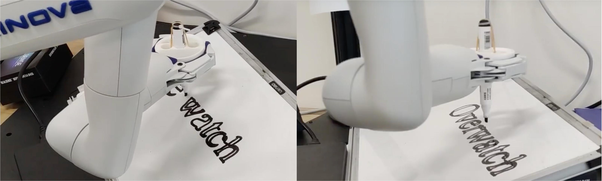

WHO AM I
===
I'm Wang Haoran(CrisWang), a senior undergraduate student from [Southern University of Science and Technology(SUSTech)](https://www.sustech.edu.cn), major in **Robotics Engineering** and interest in industry design.

My research interest includes **on-site application robots** and **exoskeleton robots**.

My Curriculum Vita: [here](A_Drawing_Robot_Base_on_the_Gen3_lite_Robot_Arm-2.pdf).

Email: 12011430@mail.sustech.edu.cn

QQ: 1020102265

Publication
===

[**1. A Three-Impeller Wheel-Leg Transformable Robot with Variable Robust Adaptability to Stair Dimensions**](https://ieeexplore.ieee.org/document/10354942)
---
***Author***

•	Design and assemble the Wheel-leg transformable robot SWhegPro3 and test its operating performance.

•	Analyze the results of experiments in both simulation environments and fields. 

•	Independently publish an essay to **the IEEE International Conference on Robotics and Biomimetics 2023**.

 

**2. Ubiquitous Field Transportation Robots with Robust Wheel-Leg Transformable Modules(Submitted)**
---
***Author***

•	Design and assemble the Wheel-leg transformable robot SWhegPro3 and test its operating performance.

•	Analyze the results of experiments in both simulation environments and fields. 

•	Submmited to **IEEE ACCESS**.

**3. The Ground Reaction of Walking State Prediction by Limb Acceleration and Angle Information Based on Neural Network (In progress)**
---
***Author***

•	Select part of the data according to different targets, segment the gait period according to the Ground Reaction Force, normalize and standardize the data. Calculate the correlation coefficient between the target data(the Center of Pressure, Ground Reaction Force) and the reference data(angular velocity and acceleration information of IMU of foot, shank, thigh, thrunk).

Projects
===
**1. A Parallel Five-Bar SCARA Robot with Suction Cup Manipulator**
---
***Project Member***

•	Redesign the five-bar parallel robot, integrate the suction cup to the end effector as the manipulator, and then control the end effector to accurately move objects.

•	Make a video to demonstrate the performance and working principle of the SCARA robot we design.

 

**2. A Drawing Robot Based on the Gen3-lite Robot Arm (In progress, just started)**
---
***Project Leader***

•	Use CANNY in cv2 to extract the edge of the figure, and use greedy algorithm to plan the path according to the extracted point set.

•	Use depth cameras gather spatial dimensions of the work environment, focusing on the drawing surface's angles and positions.

•	Use python code to control the Gen3-lite robot arm to grab adapter as the end effector, and move according to the planned path to paint, 

**3. Mobile Kitchen Waste Classifying Robot**
---
***Project Member***

•	Find the pains and needs of the residents living in apartments who are annoyed with waste in their homes.

•	Designed a user-friendly mobile garbage sorting robot, which is equipped with three-axis robotic arms and sliding rails.

Different Me
===
Shown in the first picture in this page, i'm a outgoing boy and i think everyone's livelihood should be colorful, being an ESFP makes my life full of enthusiasm and power. I am willing to put all of meself into the career i choose.

To challenge myself, I joined the high jump team in the final year of my undergraduate, hoping to pursue excellence in a brand-new event. I am passionate about it because it 
is the only event that ends with failure in sports competitions, which means that I need to jump higher and higher to reach my goal, in line with my idea of pursuing better myself in life or work.

And im also interest in videos making. Up to now, i have uploaded 50+ videos on my social media account and get 100K+ view, some of them are about travelling, some is the record of high jump training and the match, most of which are highlights of my football "career". What make me proud is that one of the highlights is forwarded by the official account of the Premier League in Bilibili, makes more people in China know our team. [My account](https://b23.tv/PuBgKcU)

Videos
===
[Match of high jump in Guangdong Province 2023](https://b23.tv/l7CkQUz)

[Highlights of "College Cup 2021"](https://b23.tv/5Hgt3DD)

[Highlights of "College Cup 2023"](https://b23.tv/Dut0e7q)

[The first video forwarded by Premier League of Bilibili](https://b23.tv/2C0f05G)

[The second video forwarded by Premier League of Bilibili](https://b23.tv/Vnc2BWV)

[2023 Promotional video: call for new](https://b23.tv/7Nfu49q)

